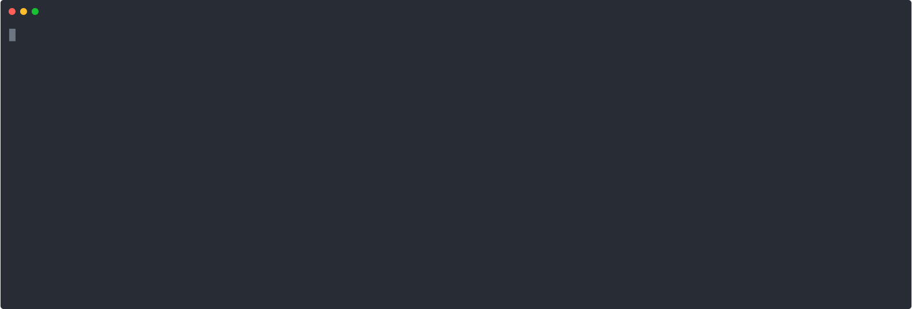
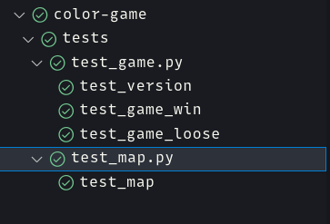
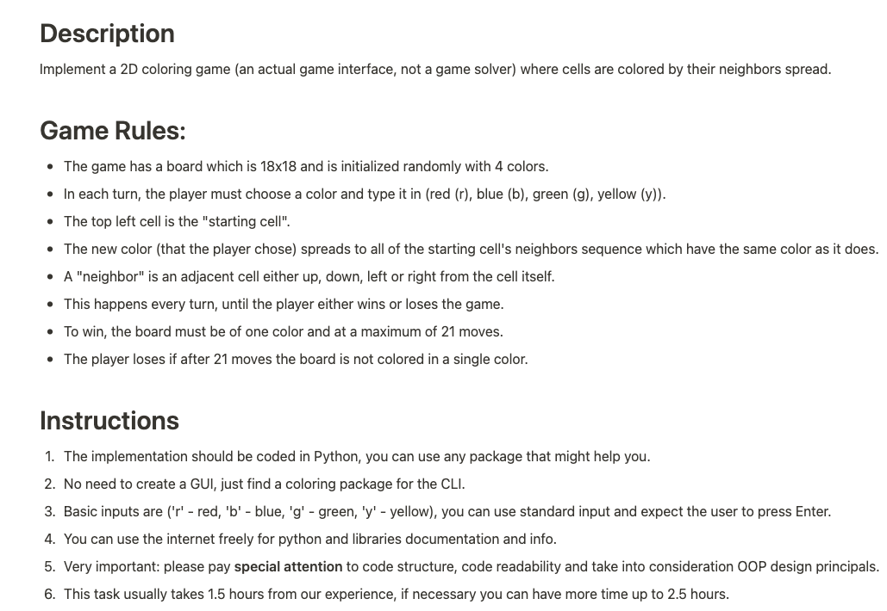

# COLOR GAME


# DEMO




You can also watch demo on asciinema:
[https://asciinema.org/a/WrZEciKh3MjruYY8frLmi5Gjo](https://asciinema.org/a/WrZEciKh3MjruYY8frLmi5Gjo)

# How to run

### using Docker

```docker run -it $(docker build -q .)```

### running python locally

```poetry install```

```poetry run python color_game/main.py```

# Whats inside ?


Game is build using python and curses. nothing extra, except build in python modules (including curses).

Code is quite simple and it should be easy to follow,

`color_game/main.py` contain curces, main game loop and key handling

Also, I there are vscode settings in this repo - so you should be able to debug code without any extra configuration (just choose proper venv)


I also add some simple tests (please don't get excited, I said simple)




to run tests:

```poetry run pytest```

Yu can also use docker to run tests

or use vscode test explorer

# DEV TOOLS USED
- flake8
- pyright
- black
- pytest
- vscode


# DESCRIPTION


